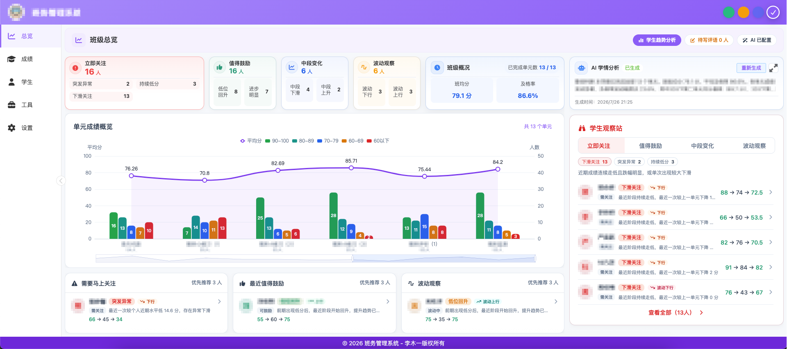
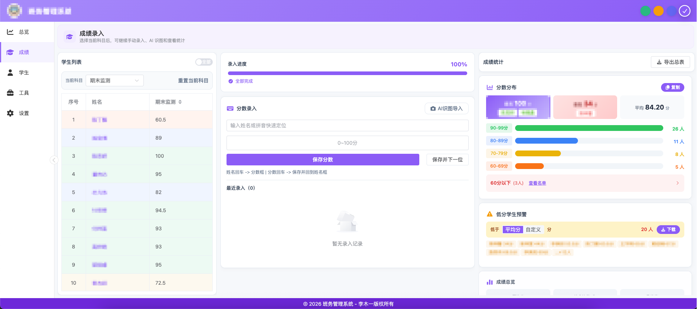
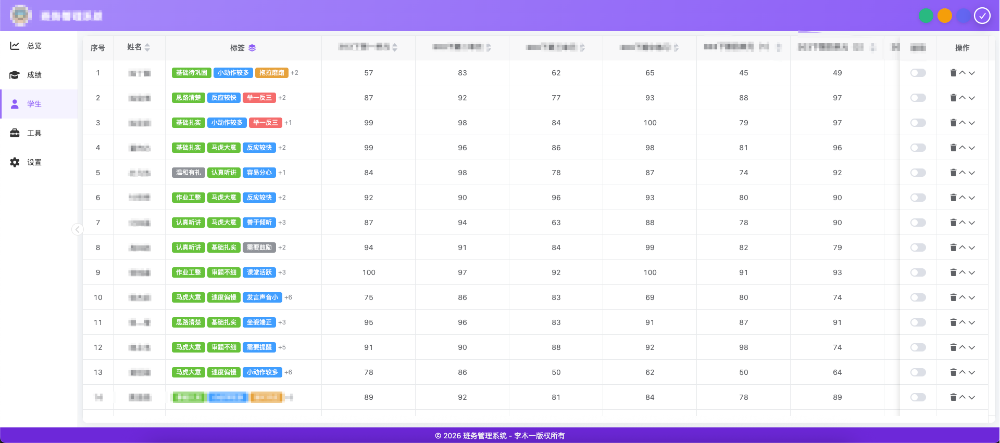
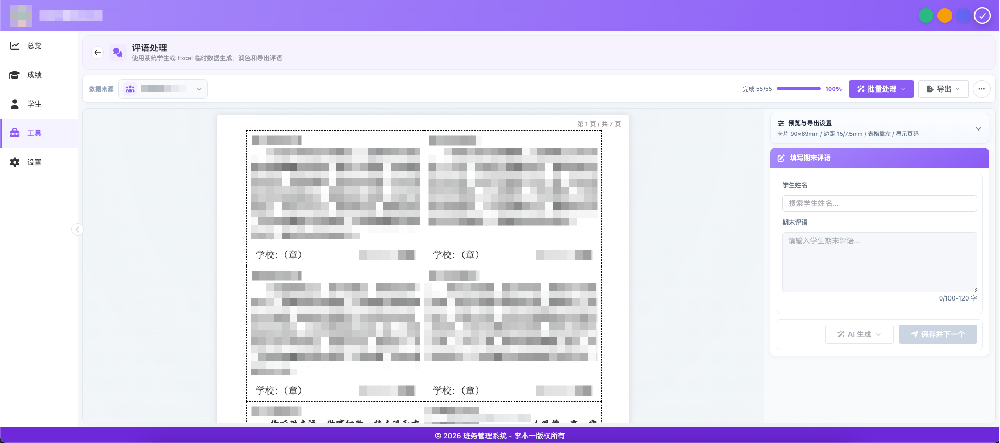
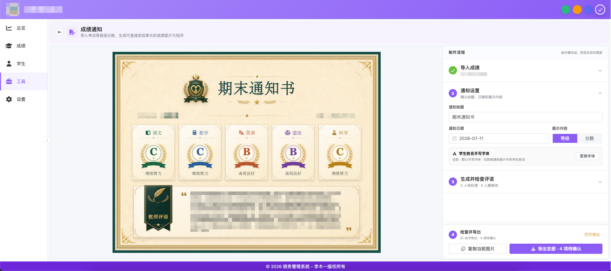
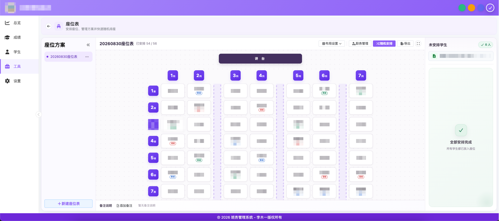
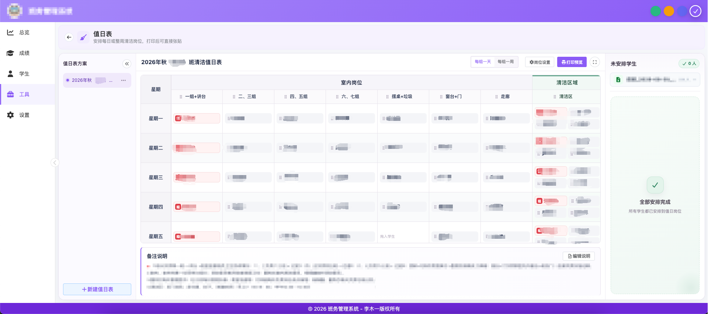
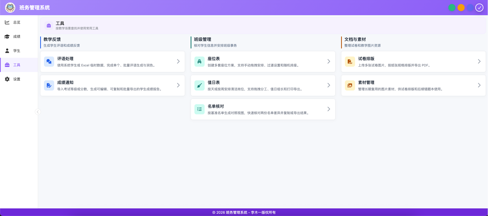
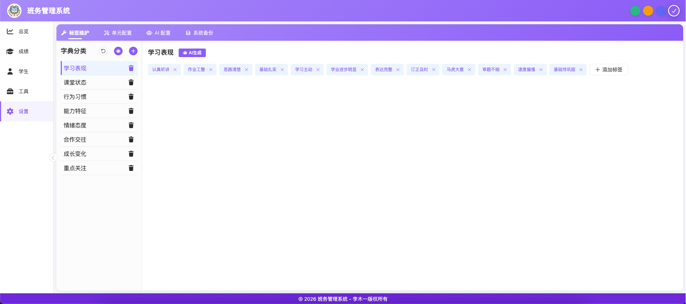

# 班务管理系统


一个面向班主任和任课教师的桌面端班级管理工具，覆盖学生信息、成绩录入、学情分析、期末评语、成绩通知、座位表、值日表和常用教学文档处理等场景。

项目采用本地优先的数据存储方式，学生资料默认保存在浏览器 IndexedDB 中，不依赖后端服务即可使用。

## 在线体验

[https://limuyi1.github.io/class-management-system](https://limuyi1.github.io/class-management-system)

> 在线体验中的数据保存在当前浏览器。清理站点数据、更换浏览器或设备前，请先在设置中导出备份。

## 项目截图

### 班级总览

<p align="center">
  <a href="./docs/screenshots/overview.png">
    
  </a>
</p>
<p align="center"><sub>班级总览：集中查看班级指标、单元完成度、重点学生和成绩趋势。</sub></p>

### 核心功能

<table>
  <tr>
    <td width="50%" align="center">
      <a href="./docs/screenshots/score-entry.png">
        
      </a>
      <br />
      <sub><strong>成绩录入</strong> · 快速录入、AI 识图和实时统计</sub>
    </td>
    <td width="50%" align="center">
      <a href="./docs/screenshots/student-info.png">
        
      </a>
      <br />
      <sub><strong>学生信息</strong> · 名单、成绩列和标签统一维护</sub>
    </td>
  </tr>
  <tr>
    <td width="50%" align="center">
      <a href="./docs/screenshots/comment-workspace.png">
        
      </a>
      <br />
      <sub><strong>期末评语</strong> · 撰写、AI 生成、预览和批量导出</sub>
    </td>
    <td width="50%" align="center">
      <a href="./docs/screenshots/score-notice.png">
        
      </a>
      <br />
      <sub><strong>成绩通知</strong> · 成绩导入、评语编辑和图片导出</sub>
    </td>
  </tr>
  <tr>
    <td width="50%" align="center">
      <a href="./docs/screenshots/seating-chart.png">
        
      </a>
      <br />
      <sub><strong>座位表</strong> · 拖拽排座、随机安排和打印导出</sub>
    </td>
    <td width="50%" align="center">
      <a href="./docs/screenshots/duty-roster.png">
        
      </a>
      <br />
      <sub><strong>值日表</strong> · 岗位分工、值日组长和打印预览</sub>
    </td>
  </tr>
  <tr>
    <td width="50%" align="center">
      <a href="./docs/screenshots/tools.png">
        
      </a>
      <br />
      <sub><strong>工具中心</strong> · 按教学场景组织常用班务工具</sub>
    </td>
    <td width="50%" align="center">
      <a href="./docs/screenshots/settings.png">
        
      </a>
      <br />
      <sub><strong>设置中心</strong> · 标签、成绩列、AI 和备份配置</sub>
    </td>
  </tr>
</table>

> 点击任意截图可查看原始尺寸。截图中的学生信息均为演示数据或已进行脱敏处理。

## 功能清单

| 模块 | 主要能力 | 状态 |
| --- | --- | :---: |
| 班级总览 | 班级指标、单元完成度、重点学生、趋势分析、AI 学情诊断 | ✅ |
| 学生信息 | 学生名单、启用状态、动态成绩列、标签和 Excel 数据维护 | ✅ |
| 成绩录入 | 快速定位、多列成绩、AI 识图、统计分析、Excel 导出 | ✅ |
| 学习报告 | 成绩趋势、班级对比、标签画像、AI 正文、高清图片导出 | ✅ |
| 期末评语 | 手动录入、Excel 导入、AI 生成与润色、PDF / Excel 导出 | ✅ |
| 成绩通知 | 成绩或等级导入、评语编辑、实时预览、图片批量导出 | ✅ |
| 座位表 | 多方案、拖拽排座、随机排座、过道与特殊座位、打印导出 | ✅ |
| 值日表 | 按天/按周排班、岗位管理、拖拽分工、多组长、打印导出 | ✅ |
| 名单核对 | 两份名单差异分析、结果复制与导出 | ✅ |
| 试卷排版 | 多图排版、纸张配置、草稿管理、PDF 导出 | ✅ |
| 素材管理 | 教学图片素材的导入、分类和复用 | ✅ |
| 数据备份 | Dexie 全量备份、差异预览、恢复和迁移 | ✅ |
| AI 配置 | 多服务商配置、模型获取、连接测试和提示词管理 | ✅ |
| 错题本 | 文件夹、题目编辑、AI 识别/解析、组卷和 PDF 导出 | 🧪 可选 |
| 随机点名 | 全班、小组、多人和公平模式抽取 | 📝 规划中 |
| 云端同步 | 多设备数据同步和协作 | 📝 规划中 |

## 功能详情

### 班级总览与学情分析

- 集中展示学生人数、成绩完成度、待写评语和重点关注学生。
- 按成绩区间、单元和学生标签整理班级关注分组。
- 支持单个学生趋势聚焦和多名学生成绩对比。
- 可基于当前班级数据生成 AI 学情分析，并保留分析结果。
- 支持从总览直接进入学生详情、评语处理和学习报告导出。

### 学生信息与标签

- 新增、编辑、启用、禁用和删除学生。
- 使用稳定的学生 ID 关联成绩、评语、标签和排表数据。
- 动态维护期中、期末、月考、单元测等成绩列。
- 按分类维护学生标签，并将标签用于评语、学情分析和学生画像。
- 支持 Excel 初始化名单以及追加成绩、评语等数据。

### 成绩录入与分析

- 按姓名或拼音模糊匹配学生，适合键盘连续录入。
- 姓名框回车定位学生，分数框回车保存并继续下一次录入。
- 支持多列成绩切换、最近录入记录和低分学生提示。
- 支持 AI 识别成绩图片，确认识别结果后批量写入当前成绩列。
- 实时计算平均分、及格率、优秀率、分数分布等统计信息。
- 支持导出当前成绩或全部成绩 Excel。

### 学习报告

- 汇总学生阶段成绩、班级名次、均分差和变化趋势。
- 结合学生标签生成优势、关注点和学习建议。
- 支持模板正文、AI 正文和手动修改。
- 可选择需要纳入报告的成绩项，并导出高清 PNG。

### 期末评语

- 支持系统学生数据或 Excel 临时名单两种来源。
- 支持手动撰写、Excel 导入、快捷评语和单个 AI 生成。
- 支持批量生成和批量润色，并显示处理进度。
- 支持评语字数校验、学生定位、完成状态和分页预览。
- 可配置落款、字号和 A3 / A4 / B3 / B4 等纸张类型。
- 支持 PDF 和 Excel 导出，便于批量打印、归档和二次编辑。

### 成绩通知

- 导入分数制或等级制成绩，并维护考试科目。
- 自动整理学生成绩摘要、历史趋势和日常表现标签。
- 支持模板评语、AI 单个生成、AI 批量生成和手动编辑。
- 提供通知单实时预览、评语校验和学生快速切换。
- 支持复制单张图片、下载单张图片和批量 ZIP 导出。
- 支持自定义手写字体，适配班级通知打印场景。

### 座位表

- 创建、重命名、复制和保存多套座位方案。
- 配置行列、列号、过道和特殊座位。
- 从系统名单或 Excel 临时名单导入学生。
- 支持拖拽排座、未安排学生池和学生右键操作。
- 支持全部随机重排，或保留已安排学生并随机补充空座位。
- 支持学生职务、座位备注、全屏编辑和打印导出。

### 值日表

- 创建和维护多套值日表，可切换“每组一天”或“每组一周”。
- 从系统名单或 Excel 临时名单载入学生。
- 自定义清洁区域、岗位名称、岗位顺序和值日说明。
- 通过拖拽安排学生和调整岗位，未安排学生集中显示在侧栏。
- 支持同一分组设置多位组长，并由用户手动取消组长身份。
- 组长在岗位之间移动时保留身份，拖回未安排区域时清除身份。
- 支持全屏编辑、打印预览、纸张方向和导出参数配置。

### 名单核对

- 以一份名单为基准，对比另一份名单。
- 输出仅基准名单存在、仅对照名单存在和共同存在的结果。
- 支持复制对比结果和导出文件。

### 试卷排版与素材管理

- 上传多张试卷或教学图片，并按纸张规格进行版面编排。
- 从素材库选择长期复用的图片，无需重复上传。
- 支持图片顺序、缩放和页面配置。
- 支持保存排版草稿以及导出 PDF。

### 错题本（功能开关）

- 按文件夹管理错题，维护题干、图片、答案、解析、题型和难度。
- 支持公式编辑、图片裁切和原图管理。
- 支持 AI 识别题目内容以及生成答案和解析。
- 可勾选题目生成练习试卷并导出 PDF。
- 默认通过 `src/config/features.ts` 中的 `featureFlags.wrongBook` 控制显隐。

### 设置、AI 与数据备份

- 维护成绩列、标签分类、标签项和题型数据。
- 内置多套主题配色。
- 支持 OpenAI、Gemini、Kimi、豆包、DeepSeek 等兼容服务配置。
- 支持测试 AI 连接、获取模型列表和维护各功能提示词。
- 支持 `.dexie` 全量备份、恢复前差异预览和导入进度反馈。
- 可选择是否在备份中包含试卷排版等工具数据。

## 技术栈

| 类别 | 技术 |
| --- | --- |
| 框架 | Vue 3、Composition API、`<script setup>` |
| 构建 | Vite 8、TypeScript 6 |
| UI | Element Plus、VxeTable、Vxe PC UI、FontAwesome |
| 样式 | Tailwind CSS 4、SCSS、Scoped CSS |
| 状态管理 | Pinia |
| 本地数据库 | Dexie、dexie-export-import |
| 图表 | ECharts |
| 文档处理 | xlsx、pdf-lib、dom-to-image、KaTeX |
| 测试 | Vitest、Vue Test Utils、happy-dom |
| AI | OpenAI 兼容接口、Gemini、Kimi、豆包、DeepSeek |

## 快速开始

### 环境要求

- Node.js 20.19 或更高版本（也支持 22.12 及以上版本）
- pnpm 9 或更高版本
- 推荐使用最新版 Chrome 或 Edge

### 本地运行

```bash
git clone https://github.com/limuyi1/class-management-system.git
cd class-management-system
pnpm install
pnpm dev
```

开发服务器端口由 `.env` 中的 `VITE_PORT` 决定。

### 生产构建

```bash
pnpm build
```

构建产物输出到 `dist/` 目录。

## 常用命令

| 命令 | 说明 |
| --- | --- |
| `pnpm dev` | 启动开发服务器 |
| `pnpm build` | 类型检查并构建生产版本 |
| `pnpm build-only` | 仅执行 Vite 构建 |
| `pnpm preview` | 预览生产构建 |
| `pnpm type-check` | 执行 Vue / TypeScript 类型检查 |
| `pnpm lint` | 执行 ESLint 检查 |
| `pnpm lint:fix` | 自动修复可修复的 ESLint 问题 |
| `pnpm format` | 使用 Prettier 格式化源码 |
| `pnpm test` | 运行全部 Vitest 测试 |
| `pnpm test:watch` | 监听模式运行测试 |
| `pnpm test:coverage` | 生成测试覆盖率报告 |

## 数据与隐私

- 学生数据、成绩、评语、设置和排表数据默认保存在浏览器 IndexedDB 中。
- 项目本身不要求部署后端数据库。
- AI 功能仅在用户主动配置服务商并执行相关操作时调用外部接口。
- API Key、学生姓名、成绩和评语属于敏感信息，请勿提交到 Git 仓库或公开截图中。
- 浏览器站点数据可能因清理缓存、隐私模式或设备故障而丢失，建议定期导出 `.dexie` 备份。
- 从不可信来源导入备份或 Excel 前，请先确认文件内容。

学生数据的核心结构示例：

```json
{
  "studentId": "20240001",
  "name": "张三",
  "midterm": 85,
  "final": 92,
  "comment": "该生学习认真……",
  "tags": {
    "学习表现": ["认真", "积极"]
  }
}
```

## 项目结构

```text
src/
├── ai/                     # AI 服务与 Provider 封装
├── assets/                 # 样式、字体和静态资源
├── components/             # 公共组件与学习报告组件
├── config/                 # 菜单、主题、功能开关等配置
├── constants/              # 共享运行时常量
├── db/                     # Dexie 数据库结构与迁移
├── hooks/                  # Vue 组合式函数
├── plugins/                # Pinia 持久化等插件
├── router/                 # Vue Router 配置
├── stores/                 # Pinia 业务状态
├── types/                  # TypeScript 类型定义
├── utils/                  # Excel、PDF、排表等工具函数
└── views/
    ├── overview/           # 班级总览
    ├── score/              # 成绩录入
    ├── student-info/       # 学生信息
    ├── evaluation/         # 期末评语
    ├── score-notice/       # 成绩通知
    ├── seating-chart/      # 座位表
    ├── duty-roster/        # 值日表
    ├── wrong-book/         # 错题本
    ├── tools/              # 名单核对、试卷排版、素材管理
    ├── setting/            # 设置中心
    └── main/               # 应用主框架

tests/
├── components/             # Vue 组件测试
├── hooks/                  # 组合式函数测试
├── stores/                 # Pinia Store 测试
└── utils/                  # 工具函数测试
```

## 配置说明

### 功能开关

可在 `src/config/features.ts` 中控制实验性模块：

```ts
export const featureFlags = {
  wrongBook: false,
  questionTypeManagement: false
}
```

### AI 配置

进入“设置 → AI 配置”后填写服务商、API 地址、API Key 和模型。建议先执行连接测试，再使用识图、评语、成绩通知、错题解析或学情分析功能。

### 数据备份

进入“设置 → 系统备份”导出 `.dexie` 文件。恢复数据前会展示差异信息，请确认目标数据后再执行导入。

## 路线图

- [ ] 随机点名：全班、小组、多人和公平模式。
- [ ] 排表与学生标签、成绩区间、身高和视力等约束联动。
- [ ] 提升移动端查看体验，编辑场景仍以桌面端为主。
- [ ] 云端备份、多设备同步和可选的班级协作能力。
- [ ] 补充更多端到端测试和使用文档。

## 反馈与贡献

欢迎通过 Issue 提交问题、功能建议或使用反馈，也欢迎提交 Pull Request。提交截图、示例数据或测试文件前，请先移除学生姓名、成绩、API Key 等敏感信息。

## 许可证

本项目采用 [PolyForm Noncommercial License 1.0.0](./LICENSE)：

- 允许个人学习、研究、教学以及其他非商业目的下使用、修改和分发。
- 学校、公益组织、公共研究机构和政府机构可按许可证条款用于非商业目的。
- 不允许未经授权的商业使用、商业部署或商业分发。
- 如需商业使用，请联系项目作者取得单独的书面商业授权。

本项目属于**源码可用（source-available）**项目，不属于 OSI 定义下的开源软件。各项第三方依赖仍分别遵循其自身许可证。
